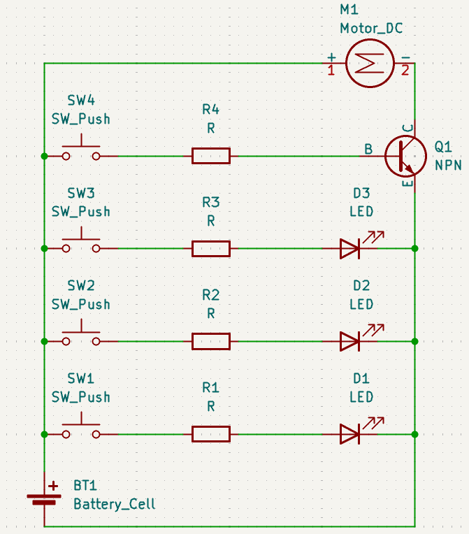
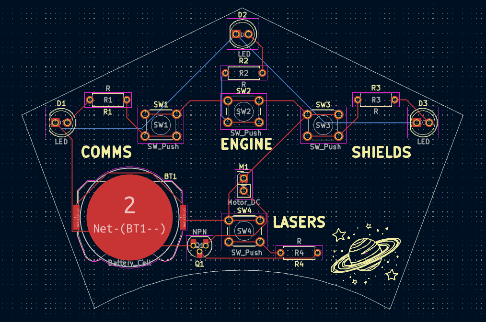
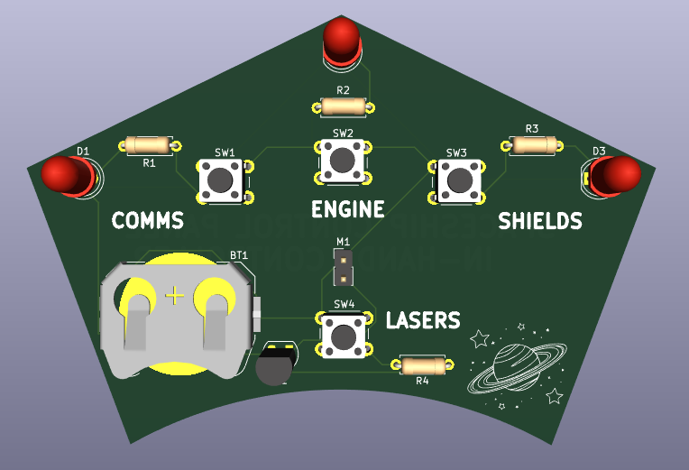

# spaceship control panel

have you ever had a spaceship, but were too lazy to go to the control room? 
introducing the all new, amazingest spaceship control panel - **HANDHELD!!!** 
now you can control your spaceship without ever getting up from the couch! 

## screenshots

### schematics:

### pcb board:

### 3d view:

## materials used:

1x CR2032 battery cell 
4x 6mm push buttons 
4x resistors (220Ω, 4.7kΩ, 47kΩ) 
3x 5mm leds 
1x 2N3904 transistor 
1x mini motor disc