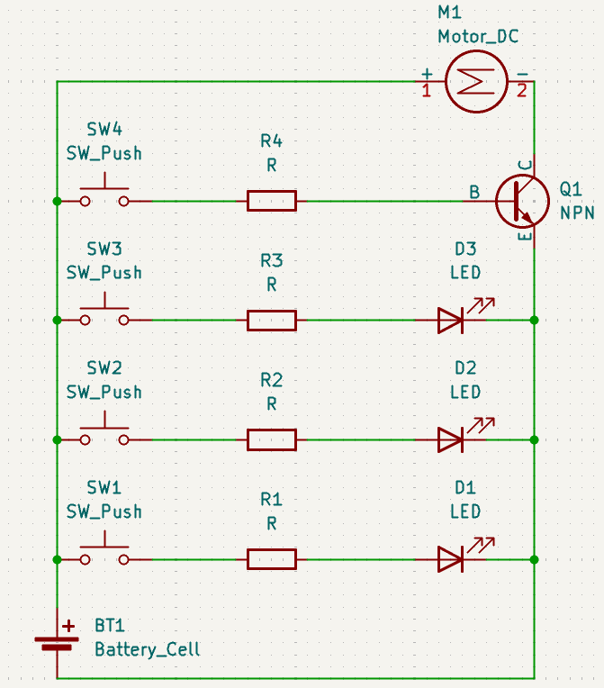
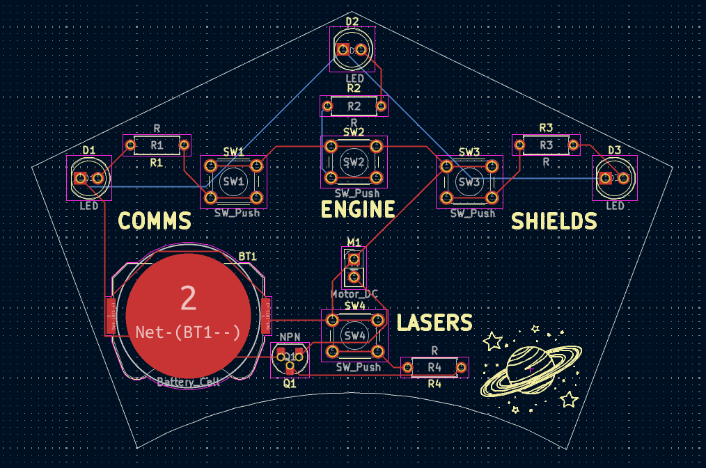
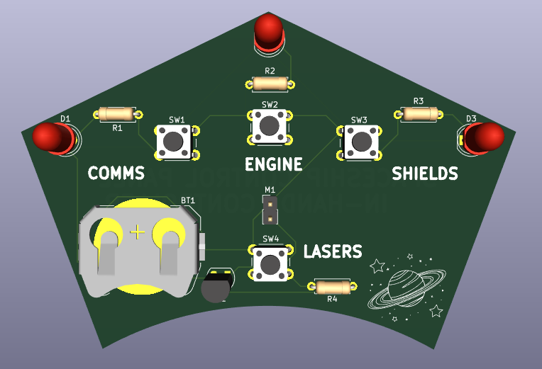

# spaceship control panel

have you ever had a spaceship, but were too lazy to go to the control room?
introducing the all new, amazingest spaceship control panel - **HANDHELD!!!**
now you can control your spaceship without ever getting up from the couch!

## screenshots

schematics:

pcb board:

3d view:

## materials used:

1x CR2032 battery cell
4x 6mm push buttons
4x resistors (220Ω, 4.7kΩ, 47kΩ)
3x 5mm leds
1x 2N3904 transistor
1x mini motor disc